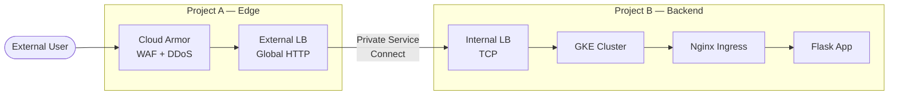
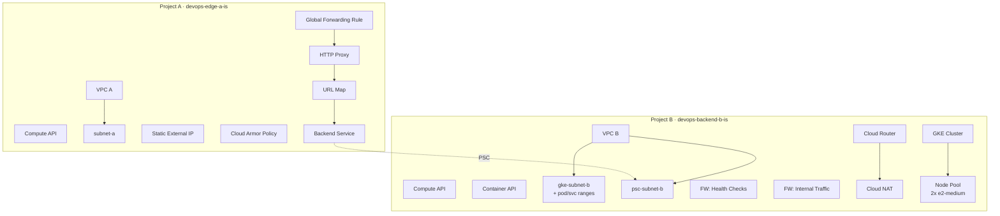

# Multi-Project GCP Architecture with Private Service Connect

This project implements a secure, two-project Google Cloud architecture where public traffic enters through one project and reaches application workloads in another -- without ever exposing the backend to the internet.

Built as part of a DevOps engineering exercise to demonstrate cross-project networking, infrastructure as code, and Kubernetes service exposure on GCP.


## How It Works

Traffic flows through seven layers before reaching the application:



**Project A** owns the public-facing edge: a global external load balancer with Cloud Armor (WAF/DDoS protection) in front. It never sees the backend directly.

**Project B** owns the application: a private GKE cluster running Nginx Ingress and a Flask app behind an internal load balancer. Nodes have no public IPs.

**Private Service Connect** bridges them. Project B publishes a Service Attachment on its internal LB. Project A consumes it through a PSC Network Endpoint Group. Traffic stays on Google's backbone -- no VPC peering, no public internet.

## What Gets Created

Terraform creates **20 GCP resources** across both projects:



The deploy script then adds on top of Terraform:
- **Nginx Ingress Controller** — L7 reverse proxy inside GKE
- **Internal LoadBalancer Service** — K8s creates this automatically with the `Internal` annotation
- **PSC Service Attachment** — publishes the internal LB to other projects
- **PSC NEG** — consumer endpoint in Project A, wired into the External LB backend
- **Flask app** — 2 replicas returning `Hello World from GKE behind Nginx Ingress!`

## Project Structure

```
.
├── terraform/
│   ├── providers.tf              # Google provider, no default project (multi-project)
│   ├── variables.tf              # project_a, project_b, region, zone, node config
│   ├── networking.tf             # VPCs, subnets, firewall rules, Cloud NAT
│   ├── gke.tf                    # Private zonal GKE cluster + node pool
│   ├── external-lb.tf            # Global external LB + Cloud Armor
│   ├── outputs.tf                # IPs, names, project IDs (used by scripts)
│   └── terraform.tfvars.example  # Template — copy to terraform.tfvars
│
├── k8s-manifests/
│   ├── flask-app.yaml            # Deployment (2 replicas) + ClusterIP Service + Ingress
│   └── nginx-internal-svc.yaml   # Overrides Nginx service to Internal LB
│
├── scripts/
│   ├── deploy.sh                 # Full deploy: terraform + kubectl + PSC wiring
│   └── destroy.sh                # Full teardown in reverse order
│
└── candidates.png                # Architecture diagram
```

## Deploy

**Prerequisites:** Two GCP projects with billing enabled. [Google Cloud Shell](https://shell.cloud.google.com) has everything else pre-installed (gcloud, terraform, kubectl).

```bash
# 1. Clone
git clone https://github.com/sunshine1247474/gcp-multi-project-architecture.git
cd gcp-multi-project-architecture

# 2. Configure
cp terraform/terraform.tfvars.example terraform/terraform.tfvars
nano terraform/terraform.tfvars   # set your project IDs

# 3. Authenticate
gcloud auth login
gcloud auth application-default login

# 4. Deploy (~15 min)
chmod +x scripts/deploy.sh
./scripts/deploy.sh

# 5. Test
curl http://$(cd terraform && terraform output -raw external_lb_ip)
# → Hello World from GKE behind Nginx Ingress!
```

## Destroy

```bash
chmod +x scripts/destroy.sh
./scripts/destroy.sh
```

This tears down PSC resources, K8s workloads, and all Terraform-managed infrastructure. Only the default VPC (no cost) remains in each project.

## Design Decisions

**Why two projects instead of one?**
Mirrors enterprise patterns where the networking/security team manages the edge (Project A) and the platform team manages workloads (Project B). PSC enforces this boundary.

**Why PSC instead of VPC peering?**
VPC peering merges route tables and flattens network boundaries. PSC keeps each project's network fully isolated — the producer doesn't even know the consumer's IP range.

**Why a zonal GKE cluster?**
Cost. A regional cluster runs 3x the nodes across 3 zones. For a demo, a single-zone cluster in `us-central1-a` keeps it under the free trial SSD quota (250 GB) and cuts compute costs.

**Why is there no health check on the backend service?**
GCP does not allow explicit health checks on backend services that use PSC NEG backends. Health status is inferred from the PSC connection state.

**Why Nginx Ingress instead of GKE's built-in ingress?**
GKE's default ingress controller creates a Google Cloud external LB per Ingress resource. Nginx gives us a single internal LB entry point that handles all L7 routing inside the cluster.

**Why HTTP instead of HTTPS?**
No domain. Managed SSL certificates require a real domain name pointed at the LB IP. For a demo, HTTP on port 80 works end-to-end. Production would add `google_compute_managed_ssl_certificate` and a `google_compute_target_https_proxy`.

## Cost

Roughly **~$6/day** when running:

| Resource | $/hr |
|:---|---:|
| GKE cluster fee | 0.10 |
| 2× e2-medium nodes | 0.07 |
| Global LB forwarding rule | 0.025 |
| Cloud NAT | 0.045 |
| Cloud Armor (basic tier) | 0.01 |
| 100 GB pd-standard | 0.004 |
| **Total** | **~0.25** |

The $300 GCP free trial covers about 49 days of continuous operation. I've added Destroy option when not in use.
